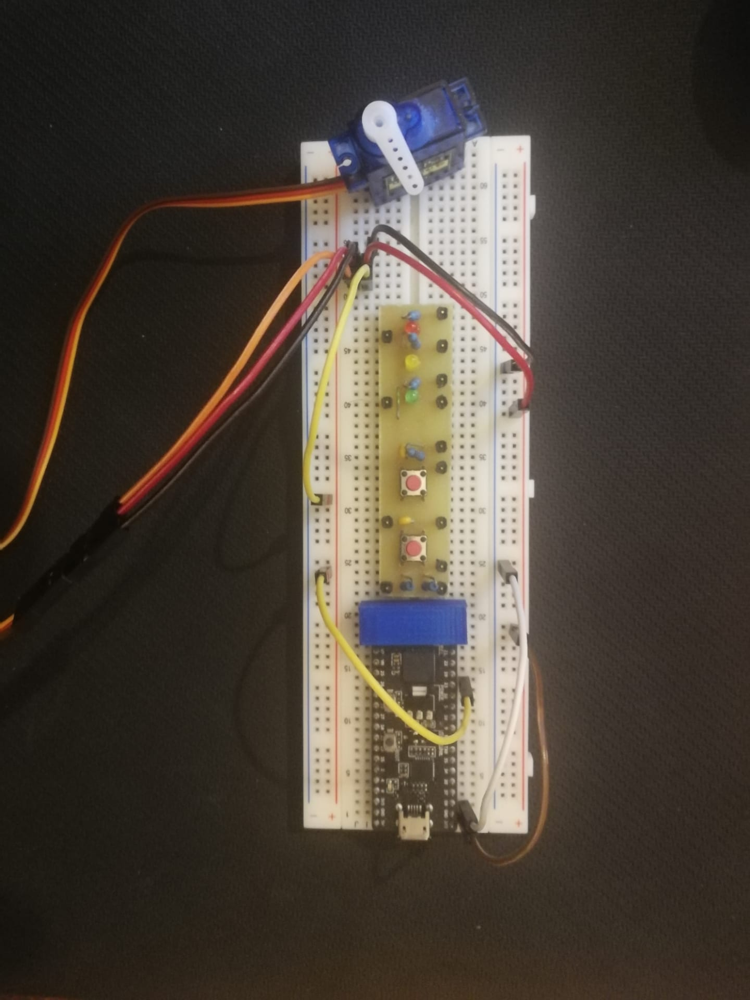

# [T02B07] : Implementação de um servidor WEB simples para controlar um Servomotor
- Nome do aluno 1: Hugo Bernardo Santos Lebre
- Nome do aluno 2: João Pedro da Silva Brito

##  Sumário
- [Introdução](#tag_sec_1)
  - [PWM e ServoMotor SG90](#tag_sec_1.1)  
  - [WebServer](#tag_sec_1.3)
- [Montagem do Circuito](#tag_sec_2)
- [Desenvolvimento do Código](#tag_sec_3)
  - [boot.py](#tag_sec_3.1)
  - [main.py](#tag_sec_3.2)
  - [secrets.py](#tag_sec_3.3)
  - [index.html](#tag_sec_3.4)
  - [style.css](#tag_sec_3.5)
- [Conclusão](#tag_sec_4)
- [Referências](#tag_sec_5)

##   Introdução 
Este projeto consiste em projetar e controlar um servo motor, máquina eletromecânica que apresenta movimento proporcional a um comando, através de um websever. 
Mais espeficicamente, fazendo uso do braço rotativo do servo motor SG90, que pode rodar entre 0 a 180º, pretendemos controlar toda a posição deste através de uma especificação do valor de ângulo pretendido no websever.

###  PWM e ServoMotor SG90

Os servo motores são atuadores comummente utilizados para aplicações onde é necessário fazer o controle de movimento com posicionamento de alta precisão, reversão rápida e de alto desempenho. 
  
Existem servo motores de corrente alternada e contínua, porém o SG90 funciona através de corrente contínua, sendo de custo relativamente baixo e muito eficiente.

Para que o servo funcione temos de fornecer uma tensão contínua de referência que é regulada consoante o ângulo que desejamos obter, neste caso.

  Uma das opções para gerar esta tensão contínua é o uso de modulação por largura de pulso ou como nos foi lecionado PWM. Através do método de PWM, com o auxílio do nosso microcontrolador ESP32 podemos então produzir sinais de controle com maior precisão e fornecer ao motor pulsos de tensão.

  No controlo do ângulo do eixo do motor, este dispositivo possui um potenciômetro interno que nos fornece um sinal de tensão que nos permite saber esse ângulo. Ao ser constantemente realimentado pela tensão de referência (e consequentemente tendo a informação do posicionamento do eixo), aquando de uma alteração do valor de tensão, este é comparado à tensão que queremos obter (a tensão do PWM), produzindo um sinal de erro com a tensão positiva ou negativa.
  
A polaridade do sinal de erro indica o sentido em que o eixo do motor roda, sendo que só irá parar de rodar quando o erro de tensão cessar.

Para o caso concreto do servo motor utilizado, SG90, uma largura de impulso de igual a o.6ms posiciona o eixo do motor em 0º e por sua vez um igual a 2.4ms posiciona o eixo em 180º. 

###  Webserver

O webserver vai ser a interface que vamos usar para controlar o servo motor. A página web apresenta um título, uma barra que permite selecionar valores desde 0 até 180, o estado de conecção "connection state" , uma caixa de texto que regista os valores de posição do eixo do servomotor e um botão delete que dá reset á caixa de texto.
  

O webserver tem a capacidade de trocar informação para o ESP32 através das "WebSockets" que criamos, e alterar o estado do motor em função da interação com a interface do webserver.
 
##   Montagem do Circuito

O processo de montagem do circuito que nos permitiu controlar o Servomotor SG90 está exemplificado pelas imagens abaixo e consiste nas três ligações especificadas pela datasheet do SG90.

Tendo as mesmas sido descritas anteriormente(PWM, Vcc e Ground).

Estas ligações foram efetuadas consoante o esquemático da placa ESP32-PICO-D4, pelo que utilizamos o pino 3v3 como fonte de alimentação, o GND como fio terra e o pino 23 como saída para um impulso(PWM).

##   Desenvolvimento do Código

###  boot.py

No ficheiro "boot.py" procedemos à criação de um ponto de acesso WIFI, através da bilioteca "network".

Para isso precisamos de criar uma interface através da função presente na linha 5, "network.WLAN(sta.if)", e activá-la através da função "wlan.active(True)".

Em seguida, através de um "if" estabeleço que se não estiver constítuida a ligação com a rede WIFI, iremos receber um print que nos informa que estamos a tentar efetuar a conexão à rede e em seguida iremos fornecer os dados de acesso à mesma.

Uma vez connectados com sucesso iremos ter um novo print.

###  main.py

No ficheiro "main.py" começamos por importar a biblioteca "MicroWebSrv2" e ainda funções da biblioteca "machine".

Esta primeira bilbioteca é fundamental para operar a criação do webserver, utilizando as funcionalidades de comunicação sem fios, via WIFI.

A segunda biblioteca, "machine" tira partido das portas do ESP32 e permite importar as funções "Pin" e "PWM", necessárias para criar o impulso, que é enviado ao Servomotor para que este seja ativado.

Começamos por definir a função "rotate" que nos irá permitir controlar o Servo.
Nesta função definimos o pino no qual criamos o pulso, a sua frequência(50Hz) e o seu ciclo ativo, adequando o valor de posição recebido do webserver, "ang" , para o valor a introduzir no Servomotor para que este se desloque para o ângulo pedido "ang_2".

Em seguida, definimos várias funções para a websocket que nos vão permitir trocar informação entre o microcontrolador e o Webserver, entre elas:

- "send_msg(msg)": que permite enviar mensagens através da websocket

- "OnWebSocketTextMsg(webSocket, msg)": quando recebemos uma mensagem na websocket esta função efetua um print no terminal indicando a posição da barra, inicia a função que irá rodar o SG90 e envia uma mensagem ao webserver para atualizar a posição. 

- "OnWebSocketClosed(webSocket)": quando a websocket se fecha retorna o estado da mesma ao início, defenindo-a como "None" 

- "OnWebSocketAccepted(microWebSrv2, webSocket)": quando a websocket está definida como "None" esta função faz print, atribui a websocket que tem como argumento à variável "MyWebSockets" definindo também as funções anteriores para esta nova websocket.

Em seguida, inicializamos o construtor do Webserver através do uso da biblioteca importada no início.

Por fim, definimos uma função que permita que o webserver continue a funcionar a menos que o interrompamos ("KeyboardInterrupt"), que é o equivalente a usar o Ctrl+C.

###  secrets.py

Para estabelecer a ligação WIFI, (ligando-nos assim à rede de casa, neste caso) precisamos de definir primeiramente o nome da rede (SSID) e palavra-passe (password) da rede a que pretendemos ligar o ESP32. 

Para garantir uma maior segurança na execução do projeto, os dados de acesso à rede WIFI foram colocados num ficheiro à parte, o secrets.py.
Este é por sua vez importado para o boot.py.

###  index.html

O nosso ficheiro HTML começa por definir na "head" o nosso título para a página, "Servo Motor Controller Webpage", e importa o ficheiro style.css para fazer as alterações ao aspeto visual da mesma.

Definimos também no final o "body", no qual se encontram os diferentes elementos da página:
- "scrollBar": barra que controla a posição do servomotor
- "currentPosition": registo da posição atualizada do servomotor
- "textarea" para a "connectionstate": informação relativa ao estado de conexão com o microcontrolador
- "textarea" para os "Logs": registo das posições do servomotor
- botão de "delete": botão para apagar o registo de posições do servomotor

Em seguida definimos as funções a executar aquando da interação com a barra e o botão de delete.

Para o botão definimos a função "buttonclick", que acede ao elemento log e substitui os seus valores pelo texto "Position Log: ", retornando esta "textarea" ao formato original sem valores registados.

Por sua vez, sempre que alteramos a função da barra, o programa irá correr a função "barScrool(position)", na qual o webserver através da websocket envia uma mensagem ao ESP32 com o valor da posição.

Neste ficheiro está também icluído um "event listener" para que no caso da página ser recarregada, a função "init" seja corrida.

A função "init" quando é corrida no programa inicia a websocket(linha 18), verificando primeiro o protocolo de segurança utilizado e o caminho que esta percorre, guardando essa informação.

Da linha 19 até à linha 22 definimos funções para a websocket executar quando abre, fecha, troca informação e dá erro.
Sendo para isto necessário definir estas quatro funções (o que verificamos da linha 26 até à linha 39).

Ao executar a função para a troca de informação("onMessage(evt)") definimos ainda uma outra função, chamada "logMsg(s)" que altera a mensagem que temos na "text area" de acordo com a posição da barra

###  style.css

No ficheiro "style.css", o qual importamos no ficheiro "index.html", definimos o aspecto/estilo do site.

Para isso bastou escolher o elemento da página que queriamos alterar e efetuar essas mudanças.

No nosso projeto optamos por fazer alterações simples, tais como a mudança de tamanhos, cores de fundo, bordas, alinhamento, margem ou transparência.

    

##   Conclusão
 
Na realização deste projeto tivemos de reunir conhecimentos de diferentes áreas, entre elas escrever código e implementar funções em HTML, JavaScript, CSS e micropython. 
Todas estas funções controladas por um microcontrolador, o ESP32, o qual nos permitiu alargar a nossa visão e perceber um pouco do processo por trás das interações entre um servidor e o cliente. 
  Este processo de construção e interação entre a página Web e o nosso microcontrolador e a criação da página precisou também de ser complementada com um conhecimento da estrutra do ESP32 e do servomotor controlado, SG90, através de uma montagem que permitisse estabelecer a alimentação e controlo simultâneo do motor, em função da informação extraída da datasheet.
  Esta complementariedade de conhecimentos de várias áreas permitiu-nos aprender a criar um servidor Web simples e a analisar e adequar as funções da nossa página com as especificidades dos componentes externos.

##   Referências

[1] Datasheet SG90: http://www.ee.ic.ac.uk/pcheung/teaching/DE1_EE/stores/sg90_datasheet.pdf

[2] ESP32 e servomotor: https://randomnerdtutorials.com/esp32-servo-motor-web-server-arduino-ide/

[3] Markdown: https://www.markdownguide.org/getting-started/

[4] Markdown: https://www.markdowntutorial.com/

[5] Markdown: https://github.com/adam-p/markdown-here/wiki/Markdown-Cheatsheet#lists

[6] Páginas da docência, EDM 2021: https://paginas.fe.up.pt/~hsm/docencia/edm/edm-2020-21/

[7] CSS: https://www.w3schools.com/html/html_css.asp
  
[8] Servomotor: https://www.mundodaeletrica.com.br/o-que-e-servo-motor-e-como-funciona/
